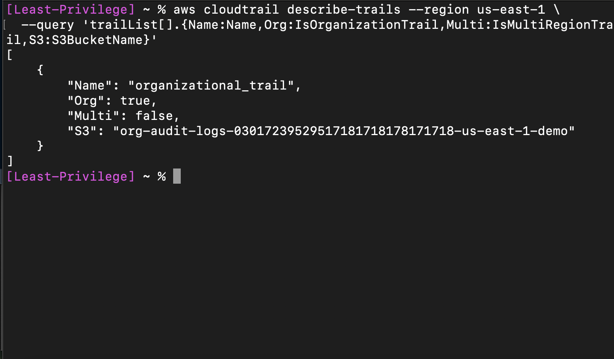
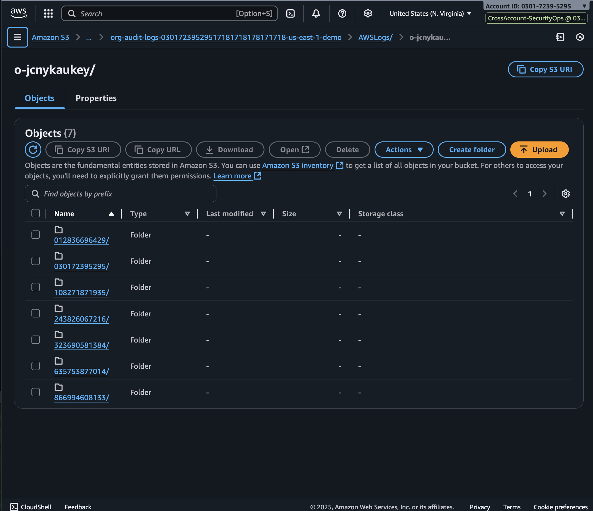
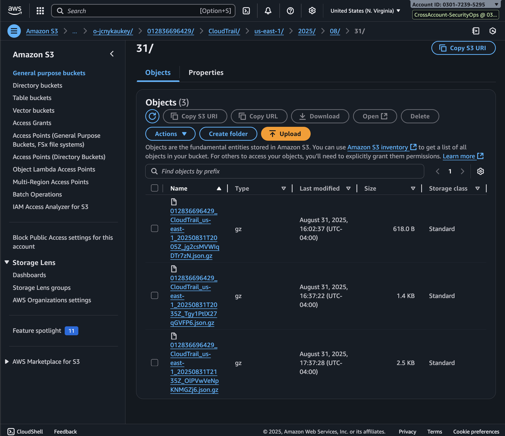
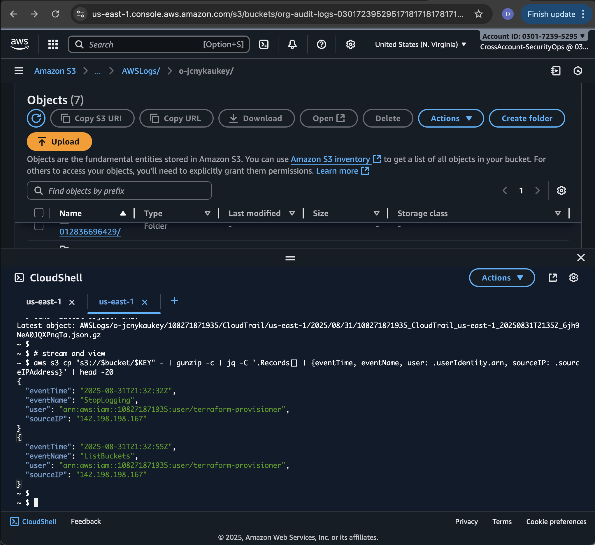
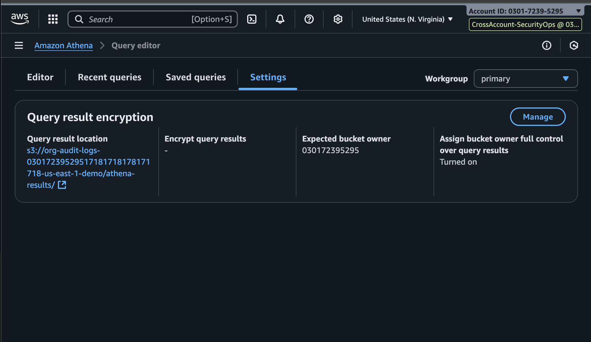
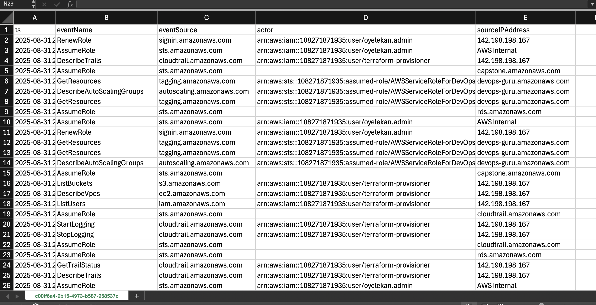
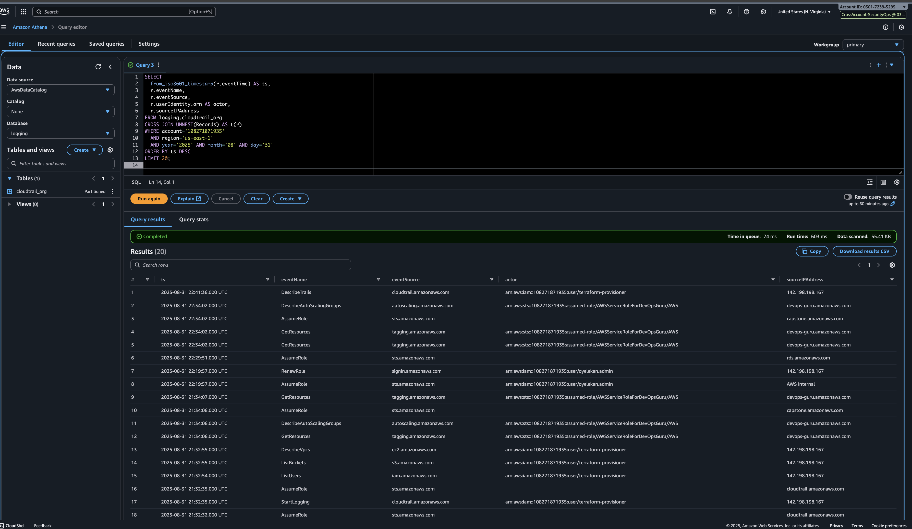

#  Centralized Audit Logging on AWS (Cloud Native SOC Portfolio)

> **Author:** Talent Nyota  
> **Role:** Cloud Security Engineer (Portfolio Project)  
> **Objective:** Build a tamper-resistant, org-wide CloudTrail pipeline for SOC operations.

---

##  Problem

In multi-account AWS Organizations, CloudTrail is often fragmented:

- Each account may or may not have trails enabled.  
- Security teams lack a **single source of truth** for investigations.  
- Logs can be tampered with (local admins stopping trails).  

 Result: **Incomplete visibility → delayed detection → compliance gaps.**

---

##  Solution: Centralized Org-Level CloudTrail

We implemented **organization-wide CloudTrail logging** with a **dedicated logging account** as the trust anchor.

Terraform + AWS Organizations enforces:

- **Org-wide CloudTrail**
  - `is_organization_trail = true`  
  - Captures all management API events across *all* accounts.  
  - Multi-Region, integrity validation enabled.

- **Centralized S3 bucket (Logging account)**
  - Encryption (AES-256 SSE by default).  
  - Public access fully blocked.  
  - Lifecycle policy → transition logs to Glacier IR after 30 days.  

- **Tight bucket policy**
  - Only `cloudtrail.amazonaws.com` can write.  
  - Enforces `bucket-owner-full-control`.

- **Cross-account role**
  - Analysts assume a `CrossAccount-SecurityOps` role into the logging account.  
  - S3 bucket access restricted to SecurityOps.

---

##  Verification Steps

### 1. CloudTrail (Management account)
```bash
aws cloudtrail describe-trails --region us-east-1 \
  --query 'trailList[].{Name:Name,Org:IsOrganizationTrail,Multi:IsMultiRegionTrail,S3:S3BucketName}'
````

Expect:

* `organizational_trail`
* `Org = true`
* `Multi = true`
* `S3 = org-audit-logs-...`

**CloudTrail shows Org Trail enabled and pointing to centralized bucket.** 


---

### 2. S3 Bucket (Logging account)

Navigate: **S3 → org-audit-logs-... → AWSLogs/o-<org-id>/**

Expect:

* Folders per account ID.
* Inside each → `/CloudTrail/us-east-1/YYYY/MM/DD/*.json.gz`

 **S3 bucket structure with org ID, accounts, and log objects**



---

### 3. Raw API Event

```bash
aws s3 cp s3://<bucket>/AWSLogs/o-<org-id>/<acct>/CloudTrail/us-east-1/2025/08/31/...json.gz - \
  | gunzip -c | jq '.Records[0]'
```

Expect JSON with fields like `eventName`, `eventTime`, `userIdentity.arn`.

 **Raw CloudTrail JSON event visible from centralized logs.**



---

### 4. Athena Query Setup

* Workgroup: `primary`
* Query result location: `s3://org-audit-logs-.../athena-results/`

 **Athena query results bucket configured**


---

### 5. Athena SQL: Recent Activity

```sql
SELECT
  from_iso8601_timestamp(r.eventTime) AS ts,
  r.eventName,
  r.eventSource,
  r.userIdentity.arn AS actor,
  r.sourceIPAddress
FROM logging.cloudtrail_org
CROSS JOIN UNNEST(Records) AS t(r)
WHERE account='108271871935'
  AND region='us-east-1'
  AND year='2025'
  AND month='08'
  AND day='31'
ORDER BY ts DESC
LIMIT 20;
```

 **Athena query results showing recent AWS API activity across org** 



---

##  Security Benefits

* **Tamper Resistance:** Only CloudTrail service can write; bucket owner enforced.
* **Forensics Ready:** One query surface → investigate incidents in minutes.
* **Scalable:** New accounts auto-log without reconfiguration.
* **Cost Aware:** Lifecycle → Glacier IR, gzip + partition projection for cheap Athena scans.

---

##  Why This Matters for a SOC

* Detect IAM policy changes in minutes.
* Spot `StopLogging` or `DeleteTrail` attempts instantly.
* Track console logins without MFA.
* Prove compliance (CIS, ISO, SOC2) with audit trail evidence.

---

---

---

##  Next Enhancements

* Send logs to **Security Lake** for SIEM integration.
* Wire Athena → QuickSight dashboards.
* Automate alerting with EventBridge + Lambda.

---

```

---

```
