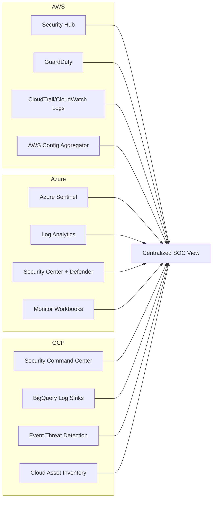

# 🌐 Cloud Security Visibility Repository  

[](https://www.terraform.io/)  
[](https://aws.amazon.com/)  
[](https://azure.microsoft.com/)  
[](https://cloud.google.com/)  
[]()  

---

## 📊 High-Level Architecture  



## Overview

cloud-security-visibility is a multi-cloud security engineering playbook designed to help organizations achieve security visibility and response at scale across AWS, Azure, and GCP. The repository demonstrates how to build a Cloud Native Security Operations Center (SOC), centralize logging, enable anomaly detection, and maintain an infrastructure asset registry using Infrastructure as Code (Terraform) and supporting automation scripts.

Security teams often struggle to see across their cloud estates. Without proper visibility, the ability to respond effectively to threats is diminished. This repo addresses that challenge by providing ready-to-use, production-grade patterns for centralizing and operationalizing cloud security. Each cloud provider is organized into its own folder, with submodules covering SOC setup, logging, anomaly detection, and asset inventory. Python and SDK-based helpers are included where Terraform alone cannot cover functionality, ensuring a complete end-to-end implementation.

For AWS, you will find recipes for Security Hub, GuardDuty, centralized CloudTrail/CloudWatch logging, and AWS Config aggregators. For Azure, the repo demonstrates Azure Sentinel, Log Analytics, Security Center with Defender, and Monitor workbooks. For GCP, it includes Security Command Center, BigQuery log sinks, Event Threat Detection, and Cloud Asset Inventory feeds.

The project is structured to reflect real-world, senior-level practices: reusable Terraform modules, per-recipe documentation, architecture diagrams, and examples of automation pipelines. It is designed for cloud security engineers, DevOps professionals, and organizations looking to implement enterprise-grade security visibility with minimal guesswork.

At its core, this repo enables security teams to move faster through John Boyd’s OODA loop (Observe, Orient, Decide, Act) by giving them the tools to observe their environment and orient quickly to incidents. Whether for learning, job interviews, or production deployment, this repository demonstrates the skills and mindset of an engineer who can operate confidently at scale, across clouds, and under real-world security constraints.

This repository assumes:
- Familiarity with Terraform (version ~> 3 for AWS/GCP, ~> 2 for Azure).
- Access to cloud provider accounts with sufficient privileges (e.g., organization root for AWS/GCP, tenant-level for Azure).
- Python 3.x with libraries like `boto3` (for AWS) and `google-cloud-securitycenter` (for GCP) installed where scripts are used.
- Knowledge of cloud authentication mechanisms (e.g., service accounts, IAM roles, Azure AD).

**Key Principles Followed:**
- **Least Privilege:** Resources and roles are configured with minimal permissions.
- **Automation at Scale:** Solutions leverage organization-level policies, delegated admins, and multi-account/tenant strategies.
- **Cost Considerations:** Trade-offs (e.g., log sampling rates) are noted where relevant.
- **Integration:** Outputs integrate with tools like Pub/Sub, SNS, Event Hubs for alerting and workflows.
- **Compliance:** Aligns with frameworks like CIS Benchmarks, PCI DSS, NIST 800-53, and ISO 27001.

## Repository Structure

The repository is organized by cloud provider for modularity. Each provider folder contains subfolders for specific recipes (e.g., SOC setup, logging). Common files like variables.tf, provider.tf, and main.tf are included per recipe. Supporting scripts (e.g., Python for enabling services) are placed alongside the Terraform files.

```
.
├── README.md               # This file: High-level overview, setup instructions, and usage.
├── AWS/                    # AWS-specific security configurations.
│   ├── soc/                # Recipe 3.2: Building a Cloud Native SOC on AWS.
│   │   ├── main.tf
│   │   ├── provider.tf
│   │   ├── variables.tf
│   │   ├── terraform.tfvars.example  # Sample vars; rename and fill for your env.
│   │   └── create_members.py         # Script to enable Security Hub in existing accounts.
│   ├── logging/            # Recipe 3.5: Centralizing Logs on AWS.
│   │   ├── main.tf
│   │   ├── provider.tf
│   │   ├── variables.tf
│   │   └── terraform.tfvars.example
│   ├── anomaly-alerting/   # Recipe 3.8: Log Anomaly Alerting on AWS.
│   │   ├── main.tf
│   │   ├── provider.tf
│   │   ├── variables.tf
│   │   ├── terraform.tfvars.example
│   │   └── create_members.py         # Script to enable GuardDuty in existing accounts.
│   └── infrastructure-registry/  # Recipe 3.11: Building an Infrastructure Registry on AWS.
│       ├── main.tf
│       ├── provider.tf
│       ├── variables.tf
│       ├── terraform.tfvars.example
│       └── set_delegated_admin.py    # Script to set Config delegated admin.
├── Azure/                  # Azure-specific security configurations.
│   ├── soc/                # Recipe 3.3: Building a Cloud Native SOC on Azure.
│   │   ├── main.tf
│   │   ├── provider.tf
│   │   ├── variables.tf
│   │   └── terraform.tfvars.example
│   ├── logging/            # Recipe 3.6: Centralizing Logs on Azure.
│   │   ├── main.tf
│   │   ├── provider.tf
│   │   ├── variables.tf
│   │   └── terraform.tfvars.example
│   ├── anomaly-alerting/   # Recipe 3.9: Log Anomaly Alerting on Azure.
│   │   ├── main.tf
│   │   ├── provider.tf
│   │   ├── variables.tf
│   │   └── terraform.tfvars.example
│   └── infrastructure-registry/  # Recipe 3.12: Building an Infrastructure Registry on Azure.
│       ├── main.tf
│       ├── provider.tf
│       ├── variables.tf
│       ├── terraform.tfvars.example
│       └── workbook_data.json        # JSON for Azure Monitor workbook.
├── GCP/                    # GCP-specific security configurations.
│   ├── soc/                # Recipe 3.1: Building a Cloud Native SOC on GCP.
│   │   ├── auth/           # Subfolder for auth-related files.
│   │   │   ├── main.tf
│   │   │   ├── provider.tf
│   │   │   ├── variables.tf
│   │   │   └── terraform.tfvars.example
│   │   ├── main.tf
│   │   ├── provider.tf
│   │   ├── variables.tf
│   │   ├── terraform.tfvars.example
│   │   ├── main.py           # Cloud Function handler.
│   │   └── create_notification_config.py  # Script to create SCC notifications.
│   ├── logging/            # Recipe 3.4: Centralizing Logs on GCP.
│   │   ├── main.tf
│   │   ├── provider.tf
│   │   ├── variables.tf
│   │   └── terraform.tfvars.example
│   ├── anomaly-alerting/   # Recipe 3.7: Log Anomaly Alerting on GCP.
│   │   ├── main.tf
│   │   ├── provider.tf
│   │   ├── variables.tf
│   │   └── terraform.tfvars.example
│   └── infrastructure-registry/  # Recipe 3.10: Building an Infrastructure Registry on GCP.
│       ├── main.tf
│       ├── provider.tf
│       ├── variables.tf
│       └── terraform.tfvars.example
└── LICENSE                 # MIT License (or your preferred license).
```

## Getting Started

1. **Clone the Repository:**
   ```
   git clone https://github.com/devtalent2030/cloud-security-visibility
   cd cloud-security-configs
   ```

2. **Provider-Specific Setup:**
   - **AWS:** Ensure AWS CLI is configured. Update `terraform.tfvars` with account IDs and roles. Run `terraform init`, `terraform plan`, and `terraform apply` in each subfolder.
   - **Azure:** Authenticate via Azure CLI (`az login`). Update vars with locations and management group UUIDs.
   - **GCP:** Use `gcloud auth login`. Enable required APIs (e.g., Security Command Center) via console first for some recipes.

3. **Execution Order:**
   - Start with SOC recipes (3.1-3.3) for foundational visibility.
   - Proceed to logging (3.4-3.6), anomaly alerting (3.7-3.9), and registries (3.10-3.12).
   - For scripts: Install dependencies (e.g., `pip install boto3 google-cloud-securitycenter`).

4. **Customization:**
   - Extend feeds/alerts for specific resources (e.g., add conditions in GCP feeds).
   - Integrate with CI/CD pipelines for automated deployment.
   - Monitor costs: High log volumes can incur charges; adjust sampling rates as needed.

## Best Practices

- **Security:** Use encrypted variables for sensitive data (e.g., via Terraform Cloud secrets).
- **Testing:** Deploy in a non-production environment first. Use `terraform destroy` for cleanup.
- **Monitoring:** Integrate outputs with tools like Splunk, Elasticsearch, or custom Lambda/Functions for alerts.
- **Updates:** Cloud services evolve; check provider changelogs and update Terraform versions periodically.
- **Multi-Cloud:** For hybrid setups, combine recipes (e.g., Azure Security Center connectors for AWS/GCP).

## Contributing

Contributions welcome! Please fork, create a feature branch, and submit a PR. Ensure code is linted (e.g., `terraform fmt`) and tested.

## License

This repository is licensed under the MIT License. See [LICENSE](LICENSE) for details.

For questions, open an issue or contact the maintainer. This structure is designed for senior-level professionals managing enterprise-scale cloud security.